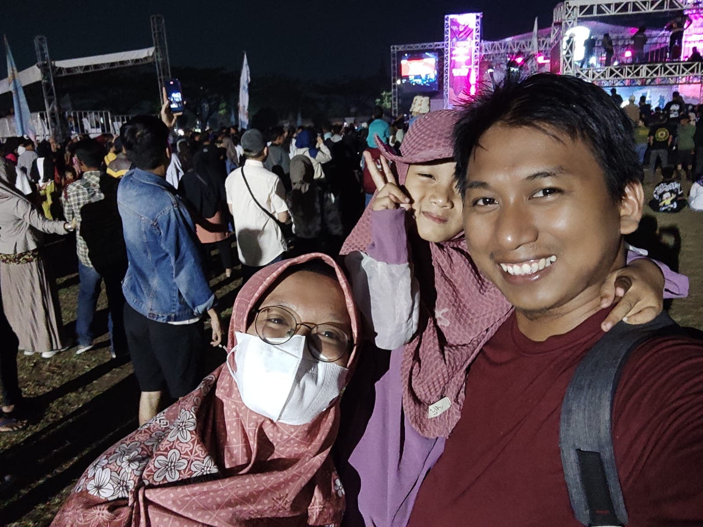

# Amiril Mukminin's Profile
This is an assignment for "my Profile"
***

## My Bio
Hi, I'm Amir. as student of Revou Batch Seoul

I'm a drafter and Analyser Engineering of Construction with years of experience in construction industry. Beside it, I'm also a Food Safety Trainer with 2 years experience in food industry particularly in GMP and HACCP Training.

My main focus is in Construction Analyser Engineering and Food Safety Trainer in GMP and HACCP. I work with AutoCad Mechanical, AutoLisp, and Visual Basic to analyze a structur of pole and concrete. 
***

## My Links

- Linkedin : [https://www.linkedin.com/in/amirilmukminin](https://www.linkedin.com/in/amirilmukminin)
- Instagram : [https://www.instagram.com/amiril.mukminin92/](https://www.instagram.com/amiril.mukminin92/)
- GitHub : [Amiril1424](https://github.com/revou-fsse-3/module-1-Amiril1424)
- Twitter : [https://twitter.com/amirmukmin92](https://twitter.com/amirmukmin92)
***

## My Technical Skills

1. AutoCad Mechanical
2. Solidworks Flow Simulation
3. Visual Basic
4. HACCP (Hazard Analysis Critical Control Points)
5. GMP (Good Manufactured Practices)
***

## My Faforite Websites

|Name     |URL                                           |Reason                   |
|----     |---                                           |------                   |
|Google   |[https://google.com](https://google.com)      |To search anything       |
|Youtube  |[https://youtube.com](https://youtube.com)    |To watch video and shorts|
|Mangakita|[https://mangakita.net](https://mangakita.net)|To read free Manga       |

***

## My Code Examples
***

### Markdown
> <b> \# Hello World </b>
>
> This is a paragraph

### HTML
> <  main    class  \= "content"   >
&nbsp;&nbsp;&nbsp;&nbsp;&nbsp; <  h1  > Hello World < /h1   >
&nbsp;&nbsp;&nbsp;&nbsp;&nbsp; <  p  > This is a paragraph < /p   >
<  /main  >

